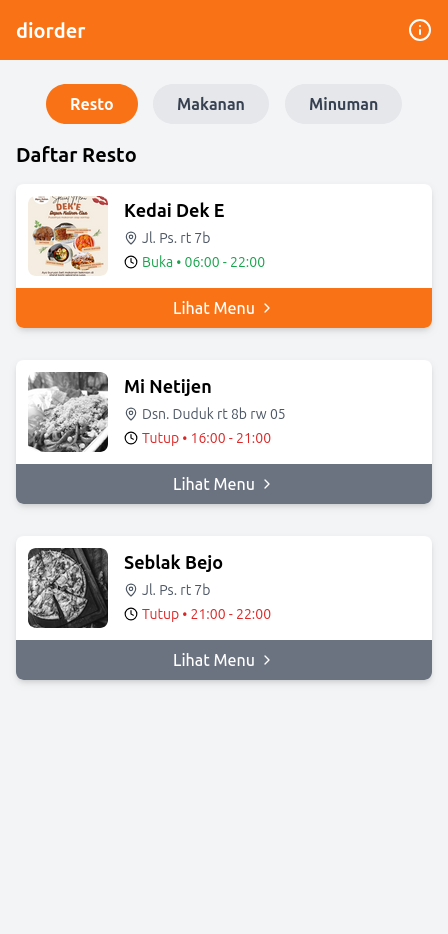
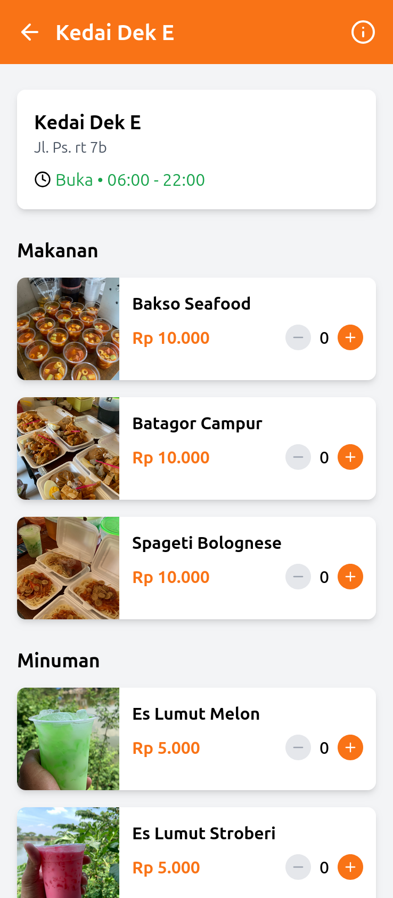
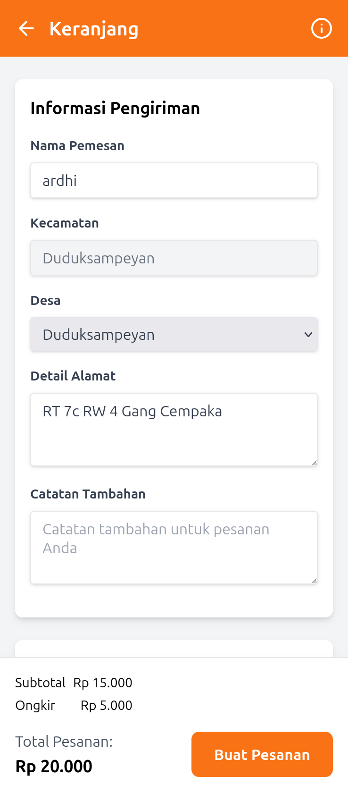
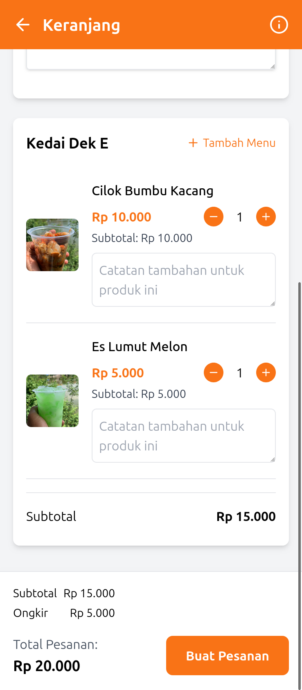

# **Diorder - Pesan Makanan Online**

**Diorder** adalah aplikasi pemesanan makanan online berbasis web yang dirancang untuk mempermudah pengguna dalam memesan makanan dari berbagai merchant. Dengan antarmuka yang sederhana dan integrasi WhatsApp, aplikasi ini memberikan pengalaman pemesanan yang cepat dan efisien.

---

## **Fitur Utama**

- **Daftar Merchant**: Menampilkan merchant dengan informasi lengkap (nama, alamat, logo, jam operasional).
- **Menu Makanan & Minuman**: Menampilkan menu dari setiap merchant dengan kategori makanan dan minuman.
- **Keranjang Belanja**: Menyimpan pesanan sementara dengan fitur edit jumlah, catatan, dan penghapusan item.
- **Checkout via WhatsApp**: Mengirim detail pesanan langsung ke kurir melalui WhatsApp.
- **Status Merchant**: Menampilkan status buka/tutup merchant berdasarkan jam operasional.
- **Pencarian**: Fitur pencarian untuk menemukan makanan, minuman, atau merchant dengan cepat.

---

## **Flow Aplikasi**

1. **Halaman Utama**:

   - Pengguna melihat daftar merchant yang tersedia.
   - Fitur pencarian untuk mencari merchant, makanan, atau minuman.
   - Tab navigasi untuk beralih antara daftar merchant, makanan, dan minuman.

2. **Halaman Menu Merchant**:

   - Pengguna memilih merchant untuk melihat daftar menu yang tersedia.
   - Pengguna dapat menambahkan item ke keranjang.

3. **Halaman Keranjang**:

   - Pengguna melihat item yang telah ditambahkan ke keranjang.
   - Pengguna dapat mengedit jumlah item, menambahkan catatan, atau menghapus item.
   - Informasi pengiriman diisi oleh pengguna.

4. **Checkout**:
   - Detail pesanan dikirim ke WhatsApp kurir untuk diproses.
   - Kurir memesan makanan ke merchant dan mengantarkannya ke pengguna.

---

## **Tech Stack**

### **Frontend**

- **React**: Framework utama untuk membangun antarmuka pengguna.
- **TypeScript**: Untuk memastikan tipe data yang konsisten.
- **Tailwind CSS**: Untuk styling yang cepat dan responsif.
- **Vite**: Build tool untuk pengembangan yang cepat.

### **Integrasi**

- **WhatsApp API**: Untuk mengirim detail pesanan ke kurir.
- **Google Maps API**: Untuk memilih lokasi pengiriman (opsional).

---

## **Instalasi**

### **1. Clone Repository**

Clone repository ini ke komputer Anda:

```bash
git clone https://github.com/username/diorder.git
cd diorder
```

### **2. Instal Dependensi**

Pastikan Anda telah menginstal **Node.js** dan **npm**. Kemudian jalankan perintah berikut:

```bash
npm install
```

### **3. Konfigurasi API Key**

Jika menggunakan fitur Google Maps, tambahkan API key Anda di file `src/components/MapModal.tsx` pada bagian berikut:

```ts
googleMapsApiKey: "YOUR_GOOGLE_MAPS_API_KEY";
```

### **4. Jalankan Aplikasi**

Untuk menjalankan aplikasi dalam mode pengembangan:

```bash
npm run dev
```

Akses aplikasi di [http://localhost:5173](http://localhost:5173).

### **5. Build untuk Produksi**

Untuk membuat build produksi:

```bash
npm run build
```

Hasil build akan tersedia di folder `dist`.

---

## **Struktur Direktori**

```
diorder/
├── src/
│   ├── components/    # Komponen UI
│   ├── context/       # Context API untuk state management
│   ├── data/          # Data dummy merchant dan menu
│   ├── pages/         # Halaman utama aplikasi
│   ├── types/         # Definisi tipe TypeScript
│   ├── utils/         # Fungsi utilitas
│   ├── App.tsx        # Entry point aplikasi
│   └── main.tsx       # File utama untuk render aplikasi
├── public/            # File statis (gambar, favicon, dll)
├── index.html         # File HTML utama
├── package.json       # Konfigurasi npm
├── tailwind.config.js # Konfigurasi Tailwind CSS
└── vite.config.ts     # Konfigurasi Vite
```

---

## **Kontribusi**

Kontribusi sangat diterima! Jika Anda menemukan bug atau memiliki ide untuk fitur baru, silakan buat **issue** atau kirimkan **pull request**.

---

## **Lisensi**

Proyek ini dilisensikan di bawah [MIT License](LICENSE).

---

## **Screenshots**

### **Halaman Utama**

Menampilkan daftar merchant dengan status buka/tutup.



### **Halaman Menu**

Menampilkan menu makanan dan minuman dari merchant yang dipilih.



### **Halaman Keranjang**

Menampilkan item yang ditambahkan ke keranjang dengan opsi checkout.





---

## **Kontak**

Jika Anda memiliki pertanyaan atau saran, silakan hubungi kami melalui [WhatsApp](https://wa.me/6282217012023).
